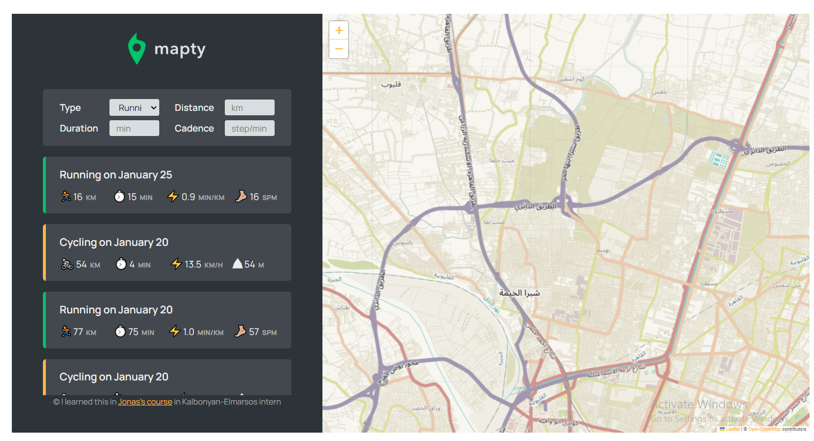

# Mapty-App

A map Application that you can use to organize and track your workouts, this APP is created for learning purposes and for practicing on (OOP, Geolocation, Project planning)

Using `Html, CSS, javaScript, leafletjs library` to build this responsive website

### Feauters:

- Geolocation to display map at current location

- Map where user clicks to add new workout
- Form to input distance, time, pace, steps/minute
- Form to input distance, time, speed, elevation gain
- Display workouts in a list
- Display workouts on the map
- Store workout data in the browser
- On page load, read the saved data and display
- Move map to workout location on click

  
  [LIVE DEMO](https://mapty-app-faried-elrewany.netlify.app/ "Mapty App")
